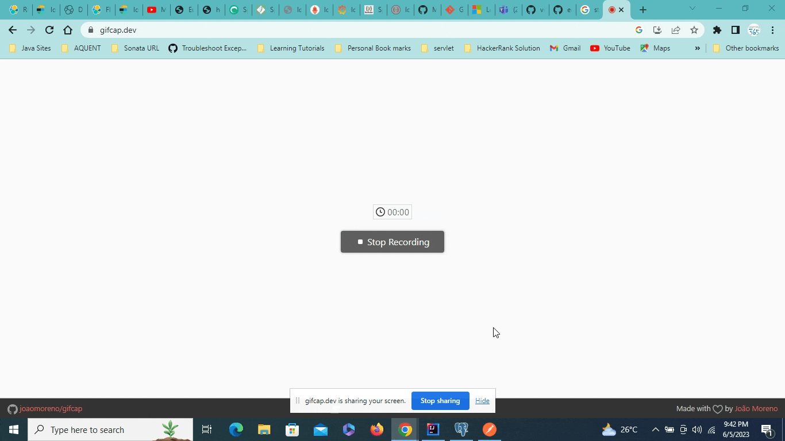
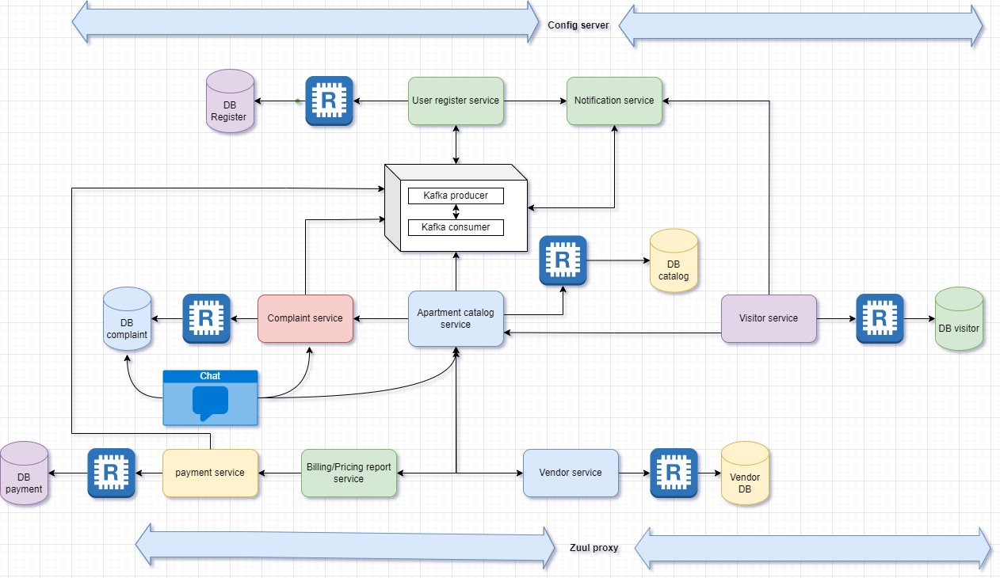

<h1 align="center">A B2B/B2C Apartment Services Apps</h1>

 </img>

ECA APARTMENT SERVICES MVP1 Model
=============================

## Version 1.0.0 - Published on June 2023

## Contents
- [Software Requirements](#softwares-requirements)
- [Architectural Diagram](#architectural-diagram)
- [Code Mode 👨🏽‍💻](#code-mode)
- [Swagger UI](#swagger-setup)
- [Jenkins Setup](#jenkins-setup)
- [ELK Setup](#elkf-setup)
- [Grafana Setup](#grafana-setup-)
- [Sonar and NFR](#sonarqube-)
- [DB Setup](#db-setup-)
- [Docker Containers details](#docker-)
- [Azure App Services](#azure-app-service-)
- [Deployment Cluster](#deployment-)
- [Tools](#tools)

## Softwares Requirements
- java 11 
- Intellij IDEA or STS
- spring boot 2.7.11 and spring cloud 2021.0.7
- h2 inner memory DB
- kafka 7.3.0
- docker latest
- postgress 7.0
- redis latest
- zookeeper 7.3.0
- mongo DB latest
- kibana, elasticsearch, filebeats, logstash 7.17.0

## Architectural Diagram
 </img>

## Code Mode

Simply run the below docker compose cmds inside the eca folder.

```bash
docker-compose -f post-redis-pgadmin-docker-compose.yml up -d
docker-compose -f kafka-grafana-promo-eca-services-app-docker-compose up -d
```
After all services containers started access discovery server using your host and port(8761).
<a>localhost:8761<a>

## Swagger Setup

After all services started access the swagger url using your host and port ex: <a>localhost:6090/swagger-ui/index.html/<a>

## Jenkins Setup

Simply run the below docker cmds in your system

```bash
docker pull jenkins/jenkins:latest
docker run -p 8080:8080 jenkins/jenkins:latest
```
After jenkins container started access jenkins server using your host and port(8080).
<a>localhost:8080<a>

## ELKF Setup

Go inside dockerComposeEKLF folder update the elastic host, kibana host and port(9200,5601) in logstash and filebeat under config conf file.
After changes just run the below docker compose cmd inside dockerComposeEKLF folder

```bash
docker-compose -f docker-compose.yml up -d
```
After all ELK containers started access elastic and kibana server using your host and port(9200, 5601).
<a>localhost:9200<a>,
<a>localhost:5601<a>


